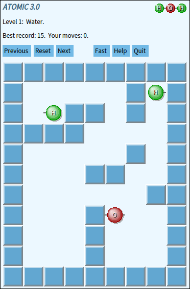
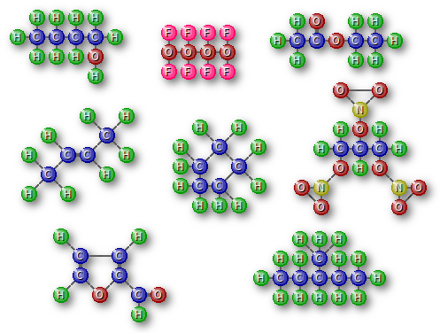

# Atomic v3: Pharo game

The goal of this game is to build a molecule using the given atoms.



The game will show a preview of the molecule to build on the top right corner. You can select an atom with a mouse click or by pressing the [TAB] key. You can move the atoms by pressing any of the cursor keys. Once an atom start moving, it cannot be stopped. It will only stop once it hits the wall or another atom. For that reason you must strategically decide which atoms to move and in which order.

This game was inspired on Atomix, from Ubuntu Linux.

## Getting Started

### Versions

Version 1: Implemented on 2005 on Smalltalk Squeak.

Version 2: Updated on 2015, but due to the use of Matrix class only ran in Pharo up to version 6.

Version 3: Updated on 2020, replaced Matrix class with Array2D and runs in Pharo 8 without error.

### Installing

* Download with GitHub as expected.
* Otherwise use Iceberg to download the package into your image.
* Download the .st file and apply it.

### Running the game

Open the playground and run:

`  AtomicGame new openInWorld.`

## Authors

**Gustavo Pistoia**

This was actually my first project in Smalltalk. I started coding this somewhere in 2005 as a way of learning Smalltalk, surely can be improved, but the overall code seems reasonable.

## License

This project is licensed under the MIT License - see the [LICENSE](LICENSE.md) file for details.

## Acknowledgments

* The Pharo community, for always answering questions and providing constant support.
* Stephane Ducasse, who make a few code changes to keep it running back in 2015.
* Guilherme de S. Pastore & Robert Roth, who I just found out were the coders of Atomix for Linux.



